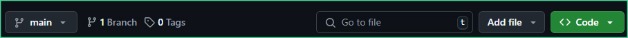
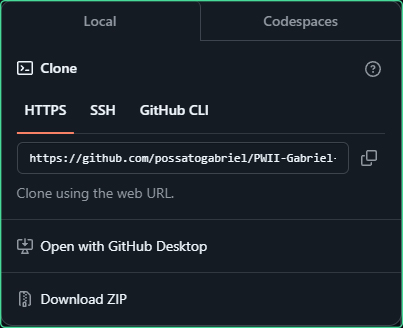
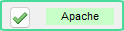
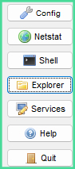
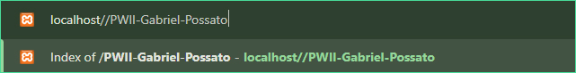

# 🖱 Programação Web III

## 📰 Descrição

Repositório das aulas de Programação Web III, lecionadas pelos professores Davi Villar e Orlando

## 💻 Tecnologias Utilizadas
`Trabalhado durante as aulas:`


          
## 💾 Como executar o programa

- Passo 1: Copie o link do repositório



- Passo 2: Utilize o seu software de preferência <a href = "https://www.apachefriends.org/pt_br/index.html"> (Xampp </a> utilizado nos exemplos) e inicie o servidor **Apache**


- Passo 3: Abra a pasta **"htdocs" (atalho no botão "Explorer" no Xampp)** e, com o terminal, clone o repositório



```COLE O CÓDIGO: git clone https://github.com/possatogabriel/PWIII-Gabriel-Possato.git```

- Passo 4: Veja os arquivos pelo **"localhost"** no seu navegador de preferência 


```COLE O CÓDIGO: localhost//PWIII-Gabriel-Possato```

## 🙋 Autores
[ <br> <sub> Gabriel Possato </sub>](https://github.com/possatogabriel)
<br>
<br>
<p align = "center">  <br/>  </p>

